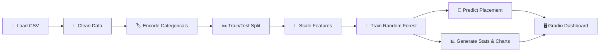

<](https://python.org)
[](https://gradio.app)
[](https://scikit-learn.org)
[](LICENSE)

---

*Predict student placement outcomes with a trained Random Forest model — visualize stats, explore data insights, and get instant predictions through a beautiful tabbed dashboard.*

</div>

---

## 📑 Table of Contents

- [✨ Features](#-features)
- [🖥️ Demo](#️-demo)
- [📊 Dataset](#-dataset)
- [🧠 Model Details](#-model-details)
- [🧰 Tech Stack](#-tech-stack)
- [⚡ Quick Start](#-quick-start)
- [📂 Project Structure](#-project-structure)
- [🔮 How It Works](#-how-it-works)
- [📈 Dashboard Tabs](#-dashboard-tabs)
- [🤝 Contributing](#-contributing)
- [📄 License](#-license)

---

## ✨ Features

| Feature | Description |
|---|---|
| 🔮 **Real-Time Prediction** | Enter student details and instantly predict placement outcome (Placed / Not Placed) |
| 📊 **Placement Statistics** | View total students, placed vs. not-placed counts, and overall placement rate |
| 📉 **Interactive Charts** | Pie chart for placement distribution & bar chart for feature-vs-placement analysis |
| 🧹 **Auto Data Cleaning** | Automatically drops ID columns, handles missing values, and encodes categorical features |
| 🎨 **Tabbed Dashboard** | Clean, multi-tab Gradio interface — Predict · Stats · Info |
| 🌐 **Shareable Link** | Launches with a public share link so anyone can access your dashboard |
| ⚙️ **Feature Scaling** | StandardScaler ensures features are normalized for optimal model performance |
| 🏷️ **Label Encoding** | Categorical variables are automatically encoded and decoded for user-friendly input |

---

## 🖥️ Demo

Once running, the dashboard is accessible at `http://localhost:7860` and via a public Gradio share link.

### 🔮 Predict Tab
> Enter student academic details (CGPA, Internships, Projects, etc.) through dropdowns and number inputs to receive an instant placement prediction.

### 📊 Stats Tab
> View placement distribution as a pie chart, feature analysis bar chart, and key statistics (total students, placement rate, model accuracy).

### ℹ️ Info Tab
> Learn about the project — model algorithm, accuracy, how the pipeline works, and the tech stack used.

---

## 📊 Dataset

The project uses **`placementdata.csv`** containing **10,000 student records** with the following features:

| # | Feature | Type | Description |
|---|---------|------|-------------|
| 1 | `StudentID` | Integer | Unique student identifier *(auto-dropped during training)* |
| 2 | `CGPA` | Float | Cumulative Grade Point Average (e.g., 7.5, 8.9) |
| 3 | `Internships` | Integer | Number of internships completed |
| 4 | `Projects` | Integer | Number of projects undertaken |
| 5 | `Workshops/Certifications` | Integer | Number of workshops or certifications attended |
| 6 | `AptitudeTestScore` | Integer | Score in aptitude test (out of 100) |
| 7 | `SoftSkillsRating` | Float | Soft skills rating (scale of 1–5) |
| 8 | `ExtracurricularActivities` | Categorical | Participation in extracurriculars (`Yes` / `No`) |
| 9 | `PlacementTraining` | Categorical | Whether the student attended placement training (`Yes` / `No`) |
| 10 | `SSC_Marks` | Integer | Secondary School Certificate marks |
| 11 | `HSC_Marks` | Integer | Higher Secondary Certificate marks |
| 12 | `PlacementStatus` | Categorical | **Target variable** — `Placed` / `NotPlaced` |

### Sample Data

```
StudentID  CGPA  Internships  Projects  Workshops  AptitudeScore  SoftSkills  ExtraCurricular  Training  SSC  HSC  Status
1          7.5   1            1         1          65             4.4         No               No        61   79   NotPlaced
2          8.9   0            3         2          90             4.0         Yes              Yes       78   82   Placed
3          7.3   1            2         2          82             4.8         Yes              No        79   80   NotPlaced
4          7.5   1            1         2          85             4.4         Yes              Yes       81   80   Placed
```

---

## 🧠 Model Details

| Property | Value |
|----------|-------|
| **Algorithm** | Random Forest Classifier |
| **Library** | scikit-learn |
| **Train/Test Split** | 80% / 20% |
| **Random State** | 42 (reproducible results) |
| **Feature Scaling** | StandardScaler (zero mean, unit variance) |
| **Encoding** | LabelEncoder for all categorical columns |
| **Target Variable** | `PlacementStatus` (binary: Placed = 1, NotPlaced = 0) |

### Pipeline Overview

```
Raw CSV → Drop NaN → Drop ID Columns → Label Encode → Train/Test Split → StandardScaler → Random Forest → Prediction
```

---

## 🧰 Tech Stack

<div align="center">

| Technology | Purpose |
|------------|---------|
|  | Core programming language |
|  | Data loading, cleaning & manipulation |
|  | ML model training, preprocessing & evaluation |
|  | Chart generation (pie & bar charts) |
|  | Interactive web dashboard UI |

</div>

---

## ⚡ Quick Start

### Prerequisites

- Python **3.8** or higher
- pip (Python package manager)

### 1️⃣ Clone the Repository

```bash
git clone https://github.com/Udasi05/Placement_prediction.git
cd Placement_prediction
```

### 2️⃣ Install Dependencies

```bash
pip install pandas gradio matplotlib scikit-learn
```

### 3️⃣ Run the Application

```bash
python app.py
```

### 4️⃣ Access the Dashboard

Once launched, you'll see output like:

```
✅ Dataset Loaded Successfully!
✅ Model trained successfully with accuracy: XX.XX%
Running on local URL: http://127.0.0.1:7860
Running on public URL: https://xxxxx.gradio.live
```

Open the local or public URL in your browser to use the dashboard.

---

## 📂 Project Structure

```
Placement_prediction/
│
├── app.py                  # Main application — data pipeline, model training & Gradio dashboard
├── placementdata.csv       # Dataset with 10,000 student records
├── README.md               # Project documentation (you are here!)
└── .github/                # GitHub configuration
```

---

## 🔮 How It Works



### Step-by-Step Breakdown

1. **Load Dataset** — Reads `placementdata.csv` using Pandas
2. **Clean Data** — Drops rows with missing values and removes non-predictive ID columns
3. **Encode Categoricals** — Converts text columns (`Yes`/`No`, `Placed`/`NotPlaced`) to numeric using LabelEncoder
4. **Split Data** — 80/20 train-test split with `random_state=42` for reproducibility
5. **Scale Features** — Applies `StandardScaler` to normalize all feature values
6. **Train Model** — Fits a `RandomForestClassifier` on the scaled training data
7. **Evaluate** — Computes accuracy on the test set
8. **Launch Dashboard** — Serves a Gradio `TabbedInterface` with Predict, Stats, and Info tabs

---

## 📈 Dashboard Tabs

### 🔮 Tab 1 — Predict

The prediction tab dynamically generates input fields based on the dataset columns:
- **Dropdowns** for categorical features (e.g., `ExtracurricularActivities`: Yes/No)
- **Number inputs** for numerical features (e.g., `CGPA`, `AptitudeTestScore`)

Enter all student details and click **Submit** to receive:
- ✅ `"🎯 The student WILL get Placed"` — if the model predicts placement
- ❌ `"The student will NOT get Placed"` — otherwise

### 📊 Tab 2 — Stats

Displays key placement metrics and visualizations:
- **Summary Statistics**: Total students, placed count, not-placed count, placement rate, model accuracy
- **Pie Chart**: Visual breakdown of Placed vs. Not Placed percentages
- **Bar Chart**: Average of the first numeric feature grouped by placement status

### ℹ️ Tab 3 — Info

A reference page covering:
- Algorithm details (Random Forest Classifier)
- Model accuracy
- Data preprocessing steps
- Tech stack used in the project

---

## 🤝 Contributing

Contributions are welcome! Here's how to get started:

1. **Fork** the repository
2. **Create** a feature branch
   ```bash
   git checkout -b feature/your-feature-name
   ```
3. **Commit** your changes
   ```bash
   git commit -m "Add: your feature description"
   ```
4. **Push** to your branch
   ```bash
   git push origin feature/your-feature-name
   ```
5. **Open** a Pull Request

### 💡 Ideas for Contribution

- [ ] Add more ML models (Logistic Regression, SVM, XGBoost) for comparison
- [ ] Implement feature importance visualization
- [ ] Add data upload functionality so users can test with their own datasets
- [ ] Export predictions to CSV
- [ ] Add confusion matrix and classification report to the Stats tab
- [ ] Dockerize the application for easy deployment

---

## 📄 License

This project is open-source and available under the [MIT License](LICENSE).

---

<div align="center">

### ⭐ Star this repo if you found it useful!

Made with ❤️ by [Udasi05](https://github.com/Udasi05)

</div>
]]>
